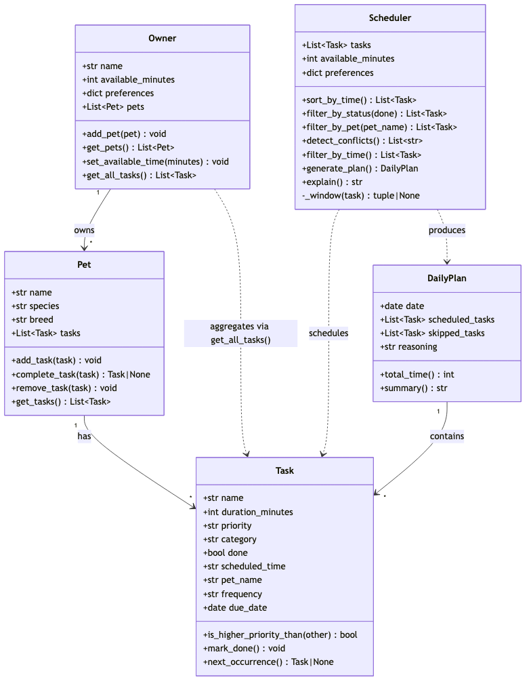

# PawPal+ (Module 2 Project)

You are building **PawPal+**, a Streamlit app that helps a pet owner plan care tasks for their pet.

## Scenario

A busy pet owner needs help staying consistent with pet care. They want an assistant that can:

- Track pet care tasks (walks, feeding, meds, enrichment, grooming, etc.)
- Consider constraints (time available, priority, owner preferences)
- Produce a daily plan and explain why it chose that plan

Your job is to design the system first (UML), then implement the logic in Python, then connect it to the Streamlit UI.

## What you will build

Your final app should:

- Let a user enter basic owner + pet info
- Let a user add/edit tasks (duration + priority at minimum)
- Generate a daily schedule/plan based on constraints and priorities
- Display the plan clearly (and ideally explain the reasoning)
- Include tests for the most important scheduling behaviors

## ✨ Features

PawPal+ implements the following scheduling algorithms in `pawpal_system.py` and
surfaces them through both a CLI demo (`main.py`) and a Streamlit UI (`app.py`):

- **⏰ Sorting by time** — `Scheduler.sort_by_time()` orders the day's tasks
  chronologically (earliest-first). Times are stored as zero-padded `"HH:MM"`
  strings so they sort as text; untimed tasks fall to the end of the day.
- **⚠️ Conflict warnings** — `Scheduler.detect_conflicts()` compares every pair of
  timed, not-done tasks and flags any whose time windows overlap — *across pets too*
  (the owner can't be in two places at once). It catches overlapping durations, not
  just identical start times, and warns rather than auto-resolving.
- **🔁 Daily & weekly recurrence** — completing a recurring task
  (`Pet.complete_task()` → `Task.next_occurrence()`) marks it done and automatically
  queues a fresh instance for the next due date. One-off (`once`) tasks never recur.
- **🔍 Filtering** — by pet (`filter_by_pet`) and by completion status
  (`filter_by_status`), so the owner can narrow a busy day to just what matters.
- **🐾 Multi-pet, multi-task model** — an `Owner` owns many `Pet`s, each owning many
  `Task`s; `Owner.get_all_tasks()` flattens them into one list for the scheduler.
- **✅ Tested** — 24 automated tests cover sorting, recurrence, conflicts, filtering,
  and edge cases (see [Testing PawPal+](#-testing-pawpal)).

## Getting started

### Setup

```bash
python -m venv .venv
source .venv/bin/activate  # Windows: .venv\Scripts\activate
pip install -r requirements.txt
```

### Suggested workflow

1. Read the scenario carefully and identify requirements and edge cases.
2. Draft a UML diagram (classes, attributes, methods, relationships).
3. Convert UML into Python class stubs (no logic yet).
4. Implement scheduling logic in small increments.
5. Add tests to verify key behaviors.
6. Connect your logic to the Streamlit UI in `app.py`.
7. Refine UML so it matches what you actually built.

## 🧪 Testing PawPal+

Run the full test suite from the project root:

```bash
python -m pytest
```

### What the tests cover

The suite (`tests/test_pawpal.py`, 24 tests) verifies the core scheduling logic plus its edge cases:

- **Sorting correctness** — tasks are returned in chronological order regardless of entry order, and untimed tasks fall to the end of the day.
- **Recurrence logic** — completing a `daily` task marks it done and auto-queues a fresh instance for the following day; `weekly` advances a week; `once` and unknown frequencies never recur; an undated recurring task anchors off today.
- **Conflict detection** — overlapping time windows are flagged (including *identical* start times), each overlapping pair is reported once, and done/untimed/malformed-time tasks are safely excluded without crashing.
- **Filtering** — tasks can be narrowed by completion status and by pet.
- **Edge cases** — empty schedulers, pets with no tasks, single tasks, malformed time strings, and zero-duration tasks are all handled without raising.

### Successful test run

```
============================= test session starts ==============================
platform darwin -- Python 3.14.3, pytest-9.1.1, pluggy-1.6.0
rootdir: /Users/ogenna/ai110-module2show-pawpal-starter
plugins: anyio-4.14.1
collected 24 items

tests/test_pawpal.py ........................                            [100%]

============================== 24 passed in 0.02s ==============================
```

### Confidence Level

**⭐⭐⭐⭐☆ (4 / 5)**

All 24 tests pass, covering every implemented behavior — sorting, filtering, recurrence, and conflict detection — along with their edge cases (empty inputs, malformed times, exact-time ties). Confidence is held at 4 rather than 5 because several `Scheduler`/`DailyPlan` methods (`generate_plan`, `filter_by_time`, `total_time`, `summary`, `explain`) are not yet implemented and therefore not yet tested; reliability of the end-to-end daily plan can't be fully vouched for until those are built and covered.

## 📐 Smarter Scheduling

Beyond the basic data model, `Scheduler` (in `pawpal_system.py`) adds four pieces of
scheduling intelligence. Each is a small, independently testable method:

| Feature | Method(s) | Notes |
|---------|-----------|-------|
| Task sorting | `Scheduler.sort_by_time()` | Orders tasks chronologically. `scheduled_time` is a zero-padded `"HH:MM"` string, so a `sorted()` lambda key sorts it as text; untimed tasks fall back to `"99:99"` and land at the end of the day. |
| Filtering | `Scheduler.filter_by_status(done)`, `Scheduler.filter_by_pet(pet_name)` | Narrows the task list to just to-do vs. done tasks, or to a single pet. `Pet.add_task()` stamps each task's `pet_name` so a flattened list stays filterable. |
| Conflict detection | `Scheduler.detect_conflicts()` (helper: `Scheduler._window()`) | Pairwise scan (via `itertools.combinations`) that flags any two timed, not-done tasks whose `[start, start + duration)` windows overlap — across pets too. Returns a list of warning strings (empty = no conflicts); never raises. |
| Recurring tasks | `Task.next_occurrence()`, `Pet.complete_task(task)` | Completing a `daily`/`weekly` task marks it done and auto-queues a fresh instance for the next due date, computed with `timedelta` (`days=1` / `weeks=1`). A `once` task never recurs. |

### Sorting behavior
`Scheduler.sort_by_time()` returns tasks earliest-first. Because times are stored as
`"HH:MM"` text, string comparison is already chronological (`"08:00" < "13:30"`), so the
sort key is simply `lambda task: task.scheduled_time or "99:99"`.

### Filtering behavior
`Scheduler.filter_by_status(done=False)` returns the still-to-do tasks (or the finished
ones with `done=True`); `Scheduler.filter_by_pet("Biscuit")` returns just that pet's tasks.

### Conflict detection logic
`Scheduler.detect_conflicts()` compares every pair of timed, not-done tasks and reports an
overlap when `start_a < end_b and start_b < end_a`. It detects *overlapping durations*, not
just identical start times — so a 30-min 08:00 walk is flagged against an 08:10 feeding. It
warns rather than auto-resolving, leaving the final call to the owner.

### Recurring task logic
`Pet.complete_task(task)` is the recurrence hook: it marks the task done, and if the task is
`daily` or `weekly`, `Task.next_occurrence()` builds a not-done copy with its `due_date`
advanced by the right `timedelta`, which `complete_task` adds back to the pet.

## 📐 System Architecture (UML)

The final class diagram for the logic layer lives at
[`diagrams/uml_final.mmd`](diagrams/uml_final.mmd) (Mermaid source):



- **Owner → Pet → Task** is the ownership chain; `Owner.get_all_tasks()` flattens
  every pet's tasks into one list (the `Owner ..> Task` dependency).
- **Scheduler** operates over that flat task list — sorting, filtering, and conflict
  detection (`_window()` is its private time-window helper) — and produces a **DailyPlan**.

## 📸 Demo Walkthrough

PawPal+ ships with two front ends over the same logic layer: an interactive
**Streamlit app** (`app.py`) and a **CLI demo** (`main.py`).

### Streamlit app — what you can do

Launch it with `streamlit run app.py`, then:

1. **Add an owner and pet** — enter the owner's name, then a pet's name and species
   and click **Add pet**.
2. **Add care tasks** — for the selected pet, set a title, duration, priority, and
   category. Optionally give it a **start time** (untimed tasks are allowed) and choose
   how often it **repeats** (once / daily / weekly), then click **Add task**.
3. **View today's schedule** — the app builds a `Scheduler` from every pet's tasks and
   renders them in a table, **sorted chronologically** (`sort_by_time()`), with a
   done marker, time, pet, duration, priority, and recurrence.
4. **See conflict warnings** — if two timed tasks overlap, an amber `st.warning`
   appears with a count and a plain-language list of each clash (from
   `detect_conflicts()`); when nothing clashes you get a green "no conflicts" success.
5. **Filter the view** — narrow the table by pet and by status (To do / Done / All).
6. **Mark a task done** — completing a daily/weekly task shows a success message and
   **auto-queues its next occurrence** (`Pet.complete_task()`).

### Example workflow

> Add owner **Ogenna** → add pet **Biscuit** (dog) → add a **08:00 Morning walk**
> and a **08:10 Feeding** for **Mittens** → open *Today's Schedule*: the two tasks are
> sorted earliest-first and PawPal+ flags the 08:00/08:10 overlap as a conflict → add a
> **daily** walk and click *Mark done* to watch tomorrow's instance appear automatically.

### Key Scheduler behaviors shown

| Behavior | Method | Shown in the demo below |
|----------|--------|-------------------------|
| Sorting by time | `sort_by_time()` | Scrambled entry order → chronological output |
| Conflict warnings | `detect_conflicts()` | 08:00 walk flagged against 08:10 feeding |
| Filter by pet | `filter_by_pet()` | Just Biscuit's tasks |
| Filter by status | `filter_by_status()` | Split of still-to-do vs. done |
| Daily recurrence | `complete_task()` | Completing the daily walk queues 2026-07-05 |

### Sample CLI output (`python main.py`)

```
====================================================
Today's Schedule for Ogenna
Time available today: 120 min
====================================================

Tasks as entered (unsorted):
----------------------------------------------------
  [ ] 17:30  Fetch / enrichment    20 min  (Biscuit, low)
  [ ] 08:00  Morning walk          30 min  (Biscuit, high)
  [ ] 12:00  Feeding               10 min  (Biscuit, high)
  [✓] 09:15  Litter box cleaning   15 min  (Mittens, medium)
  [ ] 08:10  Feeding                5 min  (Mittens, high)

Sorted by time (sort_by_time):
----------------------------------------------------
  [ ] 08:00  Morning walk          30 min  (Biscuit, high)
  [ ] 08:10  Feeding                5 min  (Mittens, high)
  [✓] 09:15  Litter box cleaning   15 min  (Mittens, medium)
  [ ] 12:00  Feeding               10 min  (Biscuit, high)
  [ ] 17:30  Fetch / enrichment    20 min  (Biscuit, low)

Conflict check (detect_conflicts):
----------------------------------------------------
  ⚠️  Conflict: 'Morning walk' (Biscuit, 08:00) overlaps 'Feeding' (Mittens, 08:10)

Filtered to Biscuit (filter_by_pet):
----------------------------------------------------
  [ ] 17:30  Fetch / enrichment    20 min  (Biscuit, low)
  [ ] 08:00  Morning walk          30 min  (Biscuit, high)
  [ ] 12:00  Feeding               10 min  (Biscuit, high)

Still to do (filter_by_status done=False):
----------------------------------------------------
  [ ] 17:30  Fetch / enrichment    20 min  (Biscuit, low)
  [ ] 08:00  Morning walk          30 min  (Biscuit, high)
  [ ] 12:00  Feeding               10 min  (Biscuit, high)
  [ ] 08:10  Feeding                5 min  (Mittens, high)

Already done (filter_by_status done=True):
----------------------------------------------------
  [✓] 09:15  Litter box cleaning   15 min  (Mittens, medium)

====================================================
Recurring tasks (complete_task auto-queues the next one)
====================================================

Before completing: Biscuit has 4 tasks.
  Completing 'Daily walk' (due 2026-07-04, daily)...
After completing:  Biscuit has 5 tasks.
  Original is now done: True
  Auto-queued next instance due: 2026-07-05 (done=False)
```
